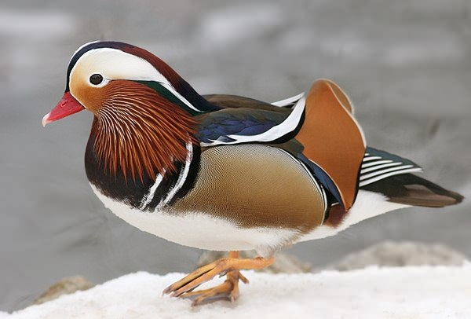

# My practice note

## Subheading

### Subheading 2

1) List item
2) Another
3) Again

- Bullet top
    - point 2
    - point 3

> A quotation

This is a *sentence* 

Here is another **sentence**

[cat playing](https://imgs.search.brave.com/CcAVmiYSCjnu9xgWGR6bCQYbv3-a_7IyGeX2KR3Ea2Q/rs:fit:500:0:1:0/g:ce/aHR0cHM6Ly90NC5m/dGNkbi5uZXQvanBn/LzAxLzA4LzA1LzU3/LzM2MF9GXzEwODA1/NTc4Nl9BdW9qZVJP/WXlZWEgzU3M4MXVC/bVlNYlNkYTdvbWpz/bS5qcGc)

This is the nth line.  
This is the n+1 th line. 

I just love __bold text__. 

 

[another duck]

